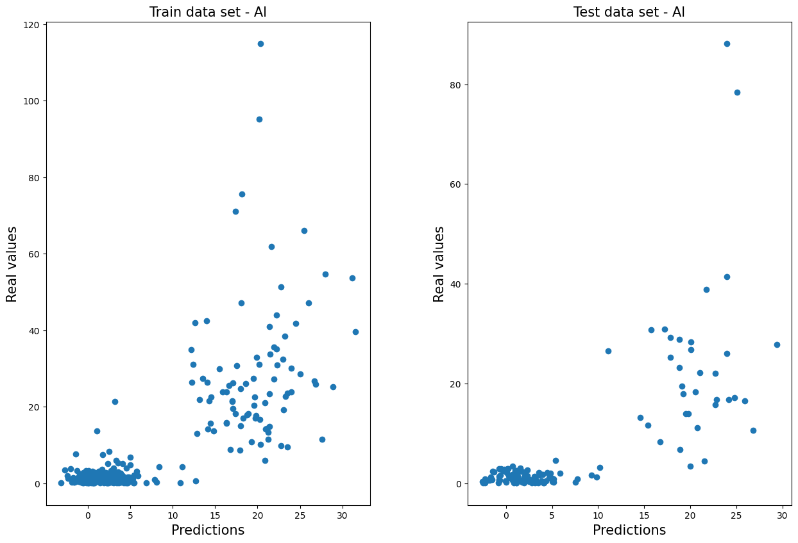

# Performance comparison between PCA Regression models and Machine Learning Algorithms for predicting the chemical compounds of cocoa (2022).

This research was developed between **ESPOL University** and **North Carolina State University**.

This research aimed to predict the chemical compounds of cocoa through machine learning algorithms, using data from leaves and almonds. Near-infrared devices were used to determine the values of the chemical compounds, and were considered as ground truths to carry out predictions. 

In addition, the XGBoost, Random Forest, OLS Regression, and SVRegression algorithms were used in this research. Results were compared with the Principal Component Regression models to evaluate the performance of the approaches. 

In the repository you can find the notebooks used to develop the estimates using ML techniques. In addition, there is a folder with graphs in which you can analyze the performance of the predictions with the different methods.

